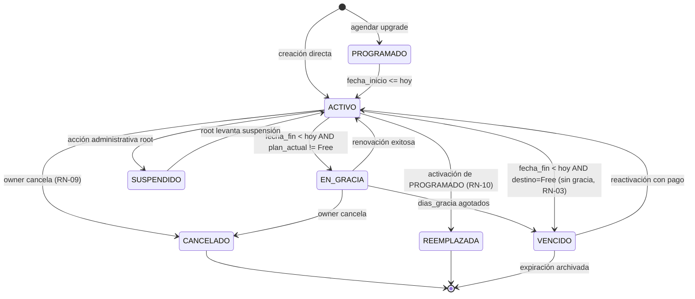

# Requerimiento: Nuevo esquema de planes SaaS (Free / Trial / Premium)

| Campo | Valor |
|---|---|
| **ID** | REQ-SAAS-001 |
| **Estado** | Aprobado — listo para descomponer en tickets técnicos |
| **Fecha creación** | 2026-07-09 |
| **Fecha aprobación** | 2026-07-09 |
| **Última revisión** | 2026-07-09 (arquitectura, seguridad, concurrencia) |
| **Autor** | Santiago Yacelga |
| **Servicios impactados** | `platform-service`, `auth-service-frond-end`, `gym-administrator/db` |
| **Versión** | 1.1 |

### Historial de cambios

| Versión | Fecha | Cambios |
|---|---|---|
| 1.0 | 2026-07-09 | Aprobación inicial con las 8 reglas de negocio, 6 HU y 4 fases. |
| 1.1 | 2026-07-09 | Incorpora hallazgos del `architect`: máquina de estados formal, matriz de autorización, eventos auditables, observabilidad, refinamientos de concurrencia (idempotencia, advisory locks), seguridad de uploads, invalidación de caché Redis, política de datos sobre-límite al degradar, y cancelación de suscripción. |

> Los valores de negocio (precio, datos bancarios, cadencia) son ajustables desde la administración de plataforma SaaS post-implementación.

---

## 1. Objetivo

Reestructurar los planes de suscripción de la plataforma SaaS para ofrecer un modelo **freemium con Trial** que maximice adopción y conversión: entrada sin fricción para gimnasios pequeños, período de prueba completo con features Premium, y opción de upgrade a Premium mensual prepago.

## 2. Motivación

- Hoy los planes son todos de pago (Básico $29.99, Premium $59.99, Enterprise $99.99) → barrera de entrada alta para captar nuevos gimnasios.
- No existe versión gratuita permanente → gimnasios pequeños no pueden probar el producto sin comprometerse.
- No existe Trial → los owners no pueden explorar features Premium antes de pagar.

## 3. Alcance

### In-scope

- Reemplazar los 3 planes actuales (Básico / Premium / Enterprise) por **Free / Trial / Premium**.
- Sistema de degradación automática al vencer Trial o Premium (destino: Free).
- Hard limits para el plan Free (1 sucursal, 50 clientes activos, 2 usuarios staff).
- Flujo de auto-registro con Trial pre-seleccionado y opción visible de Free.
- Flujo de upgrade Trial → Premium con activación programada al vencer el Trial.
- Notificaciones de vencimiento por email + banner in-app.
- Registro de pago por transferencia bancaria con comprobante y validación manual por root/soporte.

### Out-of-scope (fase 2 o posterior)

- Integración de pasarela automática (Stripe / Kushki / PayPhone).
- Renovación automática de Premium.
- Trial repetible o promocional.
- Facturación electrónica automática de la suscripción SaaS vía `billing-service`.

## 4. Los 3 planes definitivos

| Aspecto | Free | Trial | Premium |
|---|---|---|---|
| **Precio** | $0 | $0 | $29.99/mes (configurable en admin) |
| **Duración** | Permanente | 2 meses | 1 mes (prepago) |
| **Features** | Básicas: Clientes, Membresías, Asistencia, Mensajería, Seguridad, Config | Todas (equivalente a Premium) | Todas: Free + Finanzas + Marketing + Inventario |
| **Repetible** | — | No — único por tenant, irrevocable | Sí — cuantas veces quiera comprar |
| **Al vencer** | Nunca vence | Auto-degrada a Free | Auto-degrada a Free |
| **Límites cuantitativos** | 1 sucursal / 50 clientes activos / 2 staff | Sin límites | Sin límites |

## 5. Reglas de negocio

### RN-01: Trial único por tenant

- Cada compañía tiene un flag `trial_usado` (default `false`).
- Al activarse el Trial → `trial_usado = true` **inmediatamente e irrevocable**.
- Aplica incluso si el owner cancela antes de los 2 meses.
- Una vez usado → nunca más se puede reactivar Trial, aunque haya nuevos owners de la misma compañía.

### RN-02: Registro con Trial por defecto

- El wizard de auto-registro pre-selecciona el Trial.
- Link chico visible: **"Prefiero empezar con la versión gratuita básica"**.
- No se pide método de pago durante el registro (Premium solo se contrata después).

### RN-03: Degradación automática

- Job diario ya existente (`SubscriptionJobService`, 00:05 UTC) detecta suscripciones vencidas.
- Al vencer Trial o Premium → transición automática a Free.
- Cuando el plan destino es Free, **no hay período de gracia** — se cambia el mismo día del vencimiento.
- **Orden de operaciones dentro del job (crítico para evitar race conditions):**
  1. **Primero:** activar suscripciones en estado `PROGRAMADO` cuya `fechaInicio <= hoy` (upgrades agendados de Trial→Premium por RN-05).
  2. **Después:** degradar suscripciones vencidas (`fechaFin < hoy`) a su `plan_degradacion_id`.
  3. **Finalmente:** invalidar el caché Redis de `ModuloCheckService` para los tenants afectados (`DEL modulo_check:{tenant_id}:*`).
- Se registra un `TipoCambio.DEGRADACION_AUTO` (nuevo enum value) con causa: `VENCIMIENTO`, `PAGO_RECHAZADO` o `CANCELACION_MANUAL`.

### RN-04: Preservación de datos al degradar

- Data de módulos Premium (Finanzas, Marketing, Inventario) **no se borra ni se archiva**.
- Se **oculta**: menús no aparecen, endpoints retornan `403 modulo_no_incluido` (mecanismo ya existente en `ModuloCheckService`).
- Si el tenant vuelve a Premium → toda la data reaparece intacta.
- **Invalidación de caché obligatoria:** cualquier cambio de plan (upgrade, downgrade, activación) DEBE invalidar `modulo_check:{tenant_id}:*` en Redis. Sin esto, un tenant puede ver módulos por hasta 5 min (TTL 300s del caché) sin derecho, o no verlos aunque acabe de pagar Premium.

### RN-05: Upgrade Trial → Premium programado

- Durante el Trial, el owner puede **agendar** su Premium.
- Registra el pago (transferencia + comprobante); usuario root confirma → se crea suscripción Premium en estado `PROGRAMADO`.
- Cuando vence el Trial → sistema activa Premium automáticamente el mismo día.
- El owner disfruta el Trial completo hasta el último día — no pierde días de gratuidad.

### RN-06: Hard limits del plan Free

| Recurso | Límite |
|---|---|
| Sucursales | máx 1 |
| Clientes activos | máx 50 (con membresía vigente, no histórico) |
| Usuarios staff | máx 2 |
| Tipos de membresía | sin límite |
| Asistencias/mes | sin límite |

**Al crear un recurso nuevo:**
- Al superar el límite → endpoint responde `403 limite_plan_alcanzado` con payload `{ recurso, actual, maximo, plan_actual }`.
- Frontend muestra modal "Actualiza a Premium para agregar más [recurso]".
- **Concurrencia:** la validación NO puede ser un simple `SELECT COUNT` seguido de `INSERT` (race condition entre dos requests simultáneos). Debe usar `pg_advisory_xact_lock(id_compania)` en `LimiteRecursoService` para serializar la operación por tenant.

**Al degradar Trial/Premium → Free con datos existentes SOBRE el límite:**
- Los datos NO se borran (por RN-04).
- El tenant entra en modo `SOBRE_LIMITE` (nuevo flag `compania_planes.sobre_limite = true`).
- Bloqueo inmediato de creación de nuevos recursos del tipo excedido.
- Banner rojo persistente en el admin: "Tu plan actual permite máx X, tienes Y — reduce a X o vuelve a Premium".
- **Período de gracia de 30 días** para que el owner reduzca manualmente (desactivar sucursales, cancelar membresías, remover staff).
- Al pasar 30 días sin resolver → el sistema archiva automáticamente los recursos más recientes hasta cumplir el límite (registra en auditoría, no borra — soft-delete `archivado=true`).
- Al volver a Premium → los archivados vuelven a estar activos automáticamente.

### RN-07: Notificaciones de vencimiento

- Cadencia: **15, 7, 3, 1 días antes del vencimiento + día del vencimiento**.
- Canales: **email al owner + banner in-app** al hacer login.
- Misma cadencia y canales para Trial y Premium (simplicidad operativa).
- La cadencia y días de anticipación son configurables por compañía en `tenant.config_notif_suscripcion` — el owner puede reducir avisos si le resultan intrusivos.

**Idempotencia y resiliencia:**
- El predicado del job NO puede ser `diasRestantes == config.diasAntes` (si el job no corre un día por falla o deploy, se pierde el aviso).
- Debe ser: `diasRestantes <= config.diasAntes AND NOT EXISTS notif_previa(id_compania, dias_antes >= config.diasAntes)`.
- Nueva tabla `tenant.notificaciones_enviadas` (idCompania, tipo, dias_antes, fecha_envio, canal) para tracking.

**Cola y rate limit de emails:**
- 5 emails × N tenants × M vencimientos/día → posible saturación SMTP.
- Los emails se encolan en Redis (lista `mail:queue:suscripcion`) y se procesan con rate limit configurable (default 100/min).
- Retry exponencial (30s, 2m, 10m, 1h) en caso de fallo SMTP.
- Dead-letter queue (`mail:dlq:suscripcion`) tras 4 intentos fallidos; alertar a root.
- Si el email falla definitivamente, el banner in-app sigue siendo la garantía de comunicación.

**Banners in-app:**
- Se persisten en `tenant.notificaciones_enviadas` con `canal='banner'` y `descartado_at TIMESTAMPTZ NULL`.
- El owner puede descartar el banner del día actual (se marca `descartado_at`); reaparece al día siguiente si aún aplica.

### RN-08: Pago Premium por transferencia con validación manual

- El owner ve datos bancarios en el admin panel + botón "Reportar pago".
- Sube comprobante (imagen o PDF, máx 5MB) + monto + fecha + banco origen + referencia.
- Usuario **root/soporte** de la plataforma ve la lista de pagos pendientes → aprueba o rechaza con motivo.
- Al aprobar → activa Premium por 1 mes desde la fecha de aprobación (o desde el vencimiento del Trial si es upgrade programado por RN-05).

**Seguridad del upload de comprobantes:**
- Validación MIME **por magic bytes**, no por Content-Type del cliente (ej: `image/jpeg` = `FF D8 FF`, `application/pdf` = `25 50 44 46`).
- Tipos permitidos: JPEG, PNG, PDF. Cualquier otro → 400.
- Tamaño máx: 5 MB. Rechazar antes de reservar memoria.
- Almacenamiento en Cloudinary con `resource_type=raw`, `access_mode=authenticated` (NO URLs públicas).
- El admin renderiza el comprobante mediante visor de imagen / PDF.js embebido — NUNCA con `<a href>` directo (previene exfiltración de sesión root vía PDFs con JS).
- Nombre de archivo sanitizado (solo alfanuméricos + guion, máx 64 chars).
- Rate limit: máx 3 reportes de pago por tenant por hora (previene abuso de storage).

**Idempotencia:**
- Al reportar pago: se calcula un hash `SHA-256(id_compania + monto + fecha_transferencia + referencia)`; si ya existe otro pago con ese hash en estado `PENDIENTE` o `APROBADO` → responde 409 Conflict con referencia al pago existente.
- Al aprobar pago: `UPDATE ... WHERE estado='PENDIENTE'` y verificar `affectedRows == 1`. Si es 0 → 409 Conflict (evita doble aprobación concurrente por dos roots).

### RN-09: Cancelación de suscripción

El owner puede cancelar su suscripción en cualquier momento desde `MiSuscripcionPage`. El comportamiento depende del plan activo:

| Plan activo | Comportamiento al cancelar | trial_usado |
|---|---|---|
| Free | No aplica (ya está en Free permanente) | Se conserva |
| Trial | Degrada inmediato a Free. **No se libera `trial_usado`** — no puede volver a activar Trial. | Queda `true` |
| Premium | Completa el mes pagado (no se refunda). Al vencer, degrada normal a Free. | Sin cambio |
| Premium + Trial pasado | Igual que Premium (mes completo, luego Free). | Sin cambio |

- Sin refund monetario en fase 1 (documentar como política visible al owner al confirmar cancelación).
- La cancelación registra un evento `SUSCRIPCION_CANCELADA` con motivo opcional del owner (dropdown: "muy caro / no lo uso / me cambio de sistema / otro").
- Se mantiene el estado `SUSPENDIDO` para casos administrativos (root cancela por incumplimiento) — distinto de una cancelación voluntaria.

### RN-10: Prevención de suscripciones solapadas

- Constraint DB: `UNIQUE(id_compania) WHERE estado IN ('ACTIVO','EN_GRACIA')` en `tenant.compania_planes` — un tenant solo puede tener una suscripción "vigente" a la vez.
- Estado `PROGRAMADO` no cuenta como vigente y puede coexistir con ACTIVO (Trial activo + Premium agendado por RN-05).
- Al activar un PROGRAMADO, la suscripción ACTIVA/EN_GRACIA pasa a estado `REEMPLAZADA` (nuevo, indica "vencida por upgrade" no por vencimiento).

## 5bis. Máquina de estados de `CompaniaPlan.Estado`



**Transiciones prohibidas (deben rechazar en repositorio):**
- CANCELADO → cualquier otro (una cancelación es terminal — nueva suscripción crea nueva fila)
- REEMPLAZADA → cualquier otro (terminal)
- Cualquier estado → PROGRAMADO (solo se crea PROGRAMADO al insertar)

**`TipoCambio` (valores del enum, extender el existente):**
- `NUEVO` (creación desde cero)
- `RENOVACION` (mismo plan, extiende fecha)
- `UPGRADE` (Trial → Premium, Free → Premium)
- `DOWNGRADE` (Premium → Free manual)
- `DEGRADACION_AUTO` (**nuevo**: Trial/Premium → Free por vencimiento)
- `CANCELACION` (**nuevo**: iniciada por owner)
- `SUSPENSION` (**nuevo**: iniciada por root)

## 6bis. Eventos auditables

Todos los eventos siguientes se registran en `saas.actividad_plataforma` con schema:

```
{
  fecha: TIMESTAMPTZ,
  id_usuario_actor: BIGINT NULL,  -- NULL si es el sistema (job)
  tipo_actor: 'OWNER' | 'ROOT' | 'STAFF' | 'SISTEMA',
  ip_actor: INET NULL,
  id_compania: BIGINT,
  evento: VARCHAR(50),
  detalle: JSONB
}
```

### Eventos que DEBEN registrarse

| Evento | Actor típico | Detalle mínimo |
|---|---|---|
| `TRIAL_ACTIVADO` | OWNER | `{ fecha_inicio, fecha_fin }` |
| `PLAN_SELECCIONADO` | OWNER | `{ plan_codigo, precio }` |
| `PAGO_REPORTADO` | OWNER | `{ id_pago, monto, banco_origen, referencia }` |
| `PAGO_APROBADO` | ROOT | `{ id_pago, id_root, id_compania_plan_creado }` |
| `PAGO_RECHAZADO` | ROOT | `{ id_pago, id_root, motivo_rechazo }` |
| `PLAN_DEGRADADO_AUTO` | SISTEMA | `{ plan_anterior, plan_nuevo, causa, id_compania_plan_anterior }` |
| `PLAN_UPGRADED` | OWNER \| SISTEMA | `{ plan_anterior, plan_nuevo, tipo_cambio, id_compania_plan_anterior }` |
| `SUSCRIPCION_CANCELADA` | OWNER | `{ id_compania_plan, motivo_owner }` |
| `SUSCRIPCION_SUSPENDIDA` | ROOT | `{ id_compania_plan, id_root, motivo }` |
| `LIMITE_FREE_ALCANZADO` | OWNER (intento) | `{ recurso, actual, maximo }` |
| `SOBRE_LIMITE_DETECTADO` | SISTEMA | `{ recursos: [{recurso, actual, maximo}], gracia_hasta }` |
| `SOBRE_LIMITE_AUTO_ARCHIVADO` | SISTEMA | `{ recurso, ids_archivados }` |
| `NOTIF_VENCIMIENTO_ENVIADA` | SISTEMA | `{ dias_antes, canal, id_pago_relacionado }` |
| `NOTIF_EMAIL_FALLIDA` | SISTEMA | `{ id_notif, intentos, ultimo_error }` |

**Retención:** eventos se conservan 5 años (obligación de auditoría SaaS). Se archiva la tabla a S3/cold storage tras 1 año.

## 6. Historias de usuario

### HU-01 — Owner: elegir plan al registrarme

> Como **owner de un gimnasio**, quiero **elegir mi plan durante el registro** para arrancar con la modalidad que mejor se ajuste a mi negocio.

**Criterios:**
- Trial pre-seleccionado.
- Link visible para elegir Free.
- Confirmación clara de qué obtengo con cada opción.

### HU-02 — Owner: entender cuándo vence mi plan

> Como **owner**, quiero **ver claramente cuándo vence mi Trial o Premium** y recibir avisos con anticipación para no quedarme sin servicio.

**Criterios:**
- Badge de plan visible en topbar.
- Contador de días restantes.
- Notificaciones por email + in-app según cadencia de RN-07.

### HU-03 — Owner: contratar Premium

> Como **owner**, quiero **poder comprar Premium** cuando lo necesite subiendo un comprobante de transferencia.

**Criterios:**
- Formulario de datos bancarios visible.
- Upload de comprobante.
- Estado del pago visible (pendiente / aprobado / rechazado con motivo).

### HU-04 — Owner: sentir el límite de Free

> Como **owner en plan Free**, quiero **saber cuándo estoy cerca de mi límite** para decidir si upgradeo.

**Criterios:**
- Al alcanzar el límite → bloqueo claro con CTA a Premium.
- Widgets visuales: "48/50 clientes activos".

### HU-05 — Root/Soporte: aprobar pagos de suscripción

> Como **usuario root de plataforma**, quiero **ver los pagos reportados pendientes de validación** para aprobarlos o rechazarlos con un motivo.

**Criterios:**
- Bandeja de pagos pendientes.
- Ver comprobante, monto, tenant, fecha de reporte.
- Aprobar → activa Premium. Rechazar → notifica al owner con el motivo.

### HU-06 — Sistema: degradar suscripciones vencidas

> Como **sistema**, quiero **degradar automáticamente cada día las suscripciones vencidas** a Free sin intervención humana.

**Criterios:**
- Job diario ya existente (`SubscriptionJobService`).
- Sin período de gracia cuando el destino es Free.

## 7. Cambios técnicos por capa

### 7.1 Base de datos (Liquibase changeset nuevo — sugerido `202608_GYM-003`)

**Modificar tabla `saas.planes`:**

```sql
ALTER TABLE saas.planes ADD COLUMN codigo VARCHAR(20) UNIQUE;
ALTER TABLE saas.planes ADD COLUMN duracion_dias INTEGER;
ALTER TABLE saas.planes ADD COLUMN es_gratuito BOOLEAN DEFAULT false;
ALTER TABLE saas.planes ADD COLUMN plan_degradacion_id BIGINT REFERENCES saas.planes(id);
ALTER TABLE saas.planes ADD COLUMN max_sucursales INTEGER;
ALTER TABLE saas.planes ADD COLUMN max_clientes_activos INTEGER;
ALTER TABLE saas.planes ADD COLUMN max_staff INTEGER;
ALTER TABLE saas.planes ADD COLUMN moneda VARCHAR(3) DEFAULT 'USD';
ALTER TABLE saas.planes ADD COLUMN es_legacy BOOLEAN DEFAULT false;
```

- `codigo`: FREE, TRIAL, PREMIUM, LEGACY_GRANDFATHERED (para migración de tenants antiguos).
- `duracion_dias`: NULL para Free (permanente), 60 para Trial, 30 para Premium.
- `plan_degradacion_id`: FK al plan al que se degrada al vencer. Trial → Free, Premium → Free, LEGACY_GRANDFATHERED → Premium.
- `max_*`: NULL = ilimitado.
- `moneda`: default USD; preparado para futura internacionalización.
- `es_legacy`: true para planes históricos que solo existen para preservar contratos migrados.

**Modificar tabla `tenant.companias`:**

```sql
ALTER TABLE tenant.companias ADD COLUMN trial_usado BOOLEAN DEFAULT false;
ALTER TABLE tenant.companias ADD COLUMN fecha_trial_usado TIMESTAMPTZ;
```

**Modificar tabla `tenant.compania_planes`:**

```sql
ALTER TABLE tenant.compania_planes ADD COLUMN sobre_limite BOOLEAN DEFAULT false;
ALTER TABLE tenant.compania_planes ADD COLUMN sobre_limite_hasta DATE;
ALTER TABLE tenant.compania_planes ADD COLUMN causa_degradacion VARCHAR(30);
-- causa_degradacion: VENCIMIENTO / PAGO_RECHAZADO / CANCELACION_MANUAL / SUSPENSION_ROOT

-- Constraint para prevenir suscripciones solapadas (RN-10)
CREATE UNIQUE INDEX ux_compania_plan_vigente
  ON tenant.compania_planes(id_compania)
  WHERE estado IN ('ACTIVO', 'EN_GRACIA');
```

**Nueva tabla `tenant.pagos_pendientes_validacion`:**

```sql
CREATE TABLE tenant.pagos_pendientes_validacion (
  id BIGSERIAL PRIMARY KEY,
  id_compania BIGINT REFERENCES tenant.companias(id),
  id_plan_destino BIGINT REFERENCES saas.planes(id),
  monto NUMERIC(10,2),
  moneda VARCHAR(3) DEFAULT 'USD',
  fecha_reporte TIMESTAMPTZ DEFAULT NOW(),
  fecha_transferencia DATE,
  comprobante_url TEXT,
  comprobante_hash VARCHAR(64),
  banco_origen VARCHAR(80),
  referencia VARCHAR(80),
  hash_idempotencia VARCHAR(64) NOT NULL,
  estado VARCHAR(20) DEFAULT 'PENDIENTE',
  motivo_rechazo TEXT,
  aprobado_por BIGINT REFERENCES saas.usuarios_plataforma(id),
  fecha_aprobacion TIMESTAMPTZ,
  activacion_programada BOOLEAN DEFAULT false,
  factura_emitida_id BIGINT NULL
);

-- Prevenir doble reporte del mismo pago (idempotencia RN-08)
CREATE UNIQUE INDEX ux_pagos_pendientes_hash
  ON tenant.pagos_pendientes_validacion(hash_idempotencia)
  WHERE estado IN ('PENDIENTE', 'APROBADO');

-- Índices para queries frecuentes
CREATE INDEX idx_pagos_pendientes_estado_fecha
  ON tenant.pagos_pendientes_validacion(estado, fecha_reporte DESC);
CREATE INDEX idx_pagos_pendientes_compania
  ON tenant.pagos_pendientes_validacion(id_compania, fecha_reporte DESC);
```

- `estado`: PENDIENTE / APROBADO / RECHAZADO.
- `activacion_programada`: true si es upgrade Trial→Premium agendado (RN-05).
- `hash_idempotencia`: SHA-256 de `id_compania + monto + fecha_transferencia + referencia` — previene reportes duplicados por error del owner (RN-08).
- `comprobante_hash`: SHA-256 del archivo subido — auditoría e integridad.
- `factura_emitida_id`: reservado para fase 4 (facturación SRI); NULL en fase 1.

**Nueva tabla `tenant.notificaciones_enviadas` (idempotencia y tracking de RN-07):**

```sql
CREATE TABLE tenant.notificaciones_enviadas (
  id BIGSERIAL PRIMARY KEY,
  id_compania BIGINT REFERENCES tenant.companias(id),
  id_compania_plan BIGINT REFERENCES tenant.compania_planes(id),
  tipo VARCHAR(50),          -- VENCIMIENTO_TRIAL / VENCIMIENTO_PREMIUM / PAGO_RECHAZADO / etc.
  dias_antes INTEGER,        -- 15, 7, 3, 1, 0
  canal VARCHAR(20),         -- EMAIL / BANNER
  fecha_envio TIMESTAMPTZ DEFAULT NOW(),
  estado_envio VARCHAR(20),  -- ENVIADO / FALLIDO / REINTENTAR
  descartado_at TIMESTAMPTZ NULL,  -- solo para canal=BANNER
  intentos INTEGER DEFAULT 1,
  ultimo_error TEXT
);

CREATE INDEX idx_notif_compania_tipo_dias
  ON tenant.notificaciones_enviadas(id_compania_plan, tipo, dias_antes);
```

**Nueva tabla `saas.config_plataforma` (configuración runtime, ver sección 11.4):**

```sql
CREATE TABLE saas.config_plataforma (
  clave VARCHAR(100) PRIMARY KEY,
  valor TEXT NOT NULL,
  descripcion TEXT,
  modificado_por BIGINT REFERENCES saas.usuarios_plataforma(id),
  modificado_at TIMESTAMPTZ DEFAULT NOW()
);
```

**Seed:**

- Insertar los 3 planes nuevos (Free / Trial / Premium) con sus features y límites.
- Insertar plan transitorio `LEGACY_GRANDFATHERED` con las features del Enterprise antiguo (preserva contratos).
- Configurar `plan_degradacion_id`: Trial → Free, Premium → Free, LEGACY_GRANDFATHERED → Premium.
- Migrar tenants existentes: se les asigna `LEGACY_GRANDFATHERED` preservando su `fecha_fin` original; se marca `trial_usado = true`.
- Marcar planes antiguos (Básico / Premium legacy / Enterprise) con `activo = false, es_legacy = true`.

**Índices adicionales para performance:**

```sql
CREATE INDEX idx_compania_planes_estado_fecha_fin
  ON tenant.compania_planes(estado, fecha_fin);  -- usado por SubscriptionJobService

CREATE INDEX idx_compania_planes_sobre_limite
  ON tenant.compania_planes(id_compania, sobre_limite)
  WHERE sobre_limite = true;  -- usado por el job de archivado automático (RN-06)
```

### 7.2 Backend `platform-service`

**Nuevos endpoints:**

| Método | Ruta | Descripción |
|---|---|---|
| GET | `/api/v1/planes/publicos` | Retorna Free + Trial + Premium activos (actualizar) |
| POST | `/api/v1/companias/{id}/suscripcion/trial` | Activa Trial (valida `trial_usado`) |
| POST | `/api/v1/companias/{id}/pagos/reportar` | Owner reporta pago con comprobante |
| GET | `/api/v1/plataforma/pagos-pendientes` | Root lista pagos pendientes (paginado) |
| POST | `/api/v1/plataforma/pagos-pendientes/{id}/aprobar` | Root aprueba pago |
| POST | `/api/v1/plataforma/pagos-pendientes/{id}/rechazar` | Root rechaza con motivo |
| GET | `/api/v1/companias/{id}/uso-limites` | Uso actual vs límites del plan |

**Extensiones a lógica existente:**

- `SubscriptionJobService`: al degradar, aplicar `plan_degradacion_id` en lugar de ir a `VENCIDO`.
- Nuevo `LimiteRecursoService`: valida hard limits antes de crear sucursal / cliente / staff.
- Nuevo `NotificacionVencimientoJob`: corre diario, envía emails y crea banners según cadencia RN-07.

**Interceptores en creación de recursos:**

- `SucursalController.crear()`, `ClienteController.crear()`, `UsuarioController.crear()` → validar límites del plan antes de persistir.

**Infraestructura de email:**

- Componente `EmailService` (verificar si existe; probablemente `auth-service` ya tiene uno para email verification).
- Templates HTML por cada momento (T-15, T-7, T-3, T-1, T-0).

### 7.3 Frontend admin `auth-service-frond-end`

**Wizard auto-registro:**

- `Step3Plan.tsx`: rediseño para mostrar Trial pre-seleccionado + link "prefiero Free".
- Eliminar planes de pago del wizard (Premium se contrata después desde configuración).

**Nueva página `MiSuscripcionPage`:**

- Badge del plan actual + días restantes.
- Botón "Comprar Premium" (visible si está en Free o Trial).
- Historial de suscripciones y pagos.
- Banner de vencimiento (T-15, T-7, T-3, T-1, T-0).

**Nuevo modal `ReportarPagoModal`:**

- Datos bancarios (leídos de config).
- Upload de comprobante (imagen o PDF, máx 5MB).
- Campos: monto, fecha, banco origen, referencia.
- Confirmación de envío + email al owner.

**Bloqueos de límite (Free):**

- Interceptar respuestas `403 limite_plan_alcanzado` en Axios.
- Modal "Actualiza a Premium para agregar más [recurso]" con CTA a la página de suscripción.
- Widget en dashboard: "Uso actual: 48/50 clientes activos".

**Nueva página `PagosPendientesPage` (root):**

- Lista de pagos reportados en estado PENDIENTE.
- Preview de comprobante.
- Botones Aprobar / Rechazar con textarea de motivo.

### 7.4 Frontend PWA `gym-member-pwa`

- **Sin cambios funcionales** — los miembros del gym no se enteran del plan del owner.
- Consideración: si el plan del tenant queda `SUSPENDIDO` (owner canceló completamente), la PWA muestra mensaje "Servicio temporalmente inactivo, contacta a tu gimnasio".
- `attendance-service` debe retornar `503 Service Unavailable` con payload `{ codigo: 'tenant_suspendido' }` en lugar de `500` cuando un miembro intenta hacer check-in y la compañía está SUSPENDIDA. La PWA lo maneja con mensaje claro.

### 7.5 Matriz de autorización

Cada endpoint nuevo debe estar protegido con el guard adecuado de `AccessControlService`. Multi-tenant isolation es crítico: el `idCompania` debe derivarse del `JwtPrincipal`, **nunca solo del path param**.

| Endpoint | Método | Rol/Guard requerido | Validación adicional |
|---|---|---|---|
| `/api/v1/planes/publicos` | GET | Público (sin auth) | Solo retorna `activo=true AND es_legacy=false` |
| `/api/v1/companias/{id}/suscripcion` | GET | Owner o Admin del tenant | `principal.idCompania == id` |
| `/api/v1/companias/{id}/suscripcion/trial` | POST | Owner del tenant | `principal.idCompania == id` AND `trial_usado == false` |
| `/api/v1/companias/{id}/suscripcion/cancelar` | POST | Owner del tenant | `principal.idCompania == id` |
| `/api/v1/companias/{id}/pagos/reportar` | POST | Owner o Admin del tenant | `principal.idCompania == id` + rate limit 3/hora |
| `/api/v1/companias/{id}/pagos/{idPago}` | GET | Owner o Admin del tenant | `principal.idCompania == id` AND pago pertenece al tenant |
| `/api/v1/companias/{id}/uso-limites` | GET | Owner o Admin del tenant | `principal.idCompania == id` |
| `/api/v1/plataforma/pagos-pendientes` | GET | ROOT o SOPORTE | Paginado, filtros opcionales |
| `/api/v1/plataforma/pagos-pendientes/{id}/aprobar` | POST | ROOT o SOPORTE | Idempotente (UPDATE WHERE estado=PENDIENTE) |
| `/api/v1/plataforma/pagos-pendientes/{id}/rechazar` | POST | ROOT o SOPORTE | Motivo obligatorio |
| `/api/v1/plataforma/config` | GET/PUT | ROOT | Solo edita `saas.config_plataforma` |

**Regla general:** ningún endpoint acepta `idCompania` del path sin cotejar contra `principal.idCompania` (excepto endpoints de plataforma para ROOT/SOPORTE).

## 8. Criterios de aceptación

- [ ] Un tenant nuevo puede registrarse y arrancar en Trial (2 meses) sin ingresar tarjeta.
- [ ] Un tenant nuevo puede elegir Free y arrancar con límites impuestos.
- [ ] Al día 61 del Trial, el sistema degrada automáticamente a Free (job diario).
- [ ] Un tenant en Free intentando crear el cliente #51 recibe `403 limite_plan_alcanzado` y ve modal de upgrade.
- [ ] Un tenant en Trial puede reportar pago de Premium → root aprueba → Premium activa al día 61 (agendado por RN-05).
- [ ] Un tenant que agotó su Trial no puede reactivarlo (validado por `trial_usado`).
- [ ] Al vencer Premium, la data de Finanzas / Marketing / Inventario se preserva intacta y reaparece al reactivar.
- [ ] Root en el panel de plataforma ve todos los pagos pendientes y puede aprobar o rechazar.
- [ ] Un owner recibe email + banner a los 15, 7, 3, 1 días antes del vencimiento y el día del vencimiento.
- [ ] El endpoint `/api/v1/planes/publicos` retorna solo Free, Trial y Premium (los planes antiguos se ocultan).

### Criterios adicionales de concurrencia y resiliencia

- [ ] **Race condition en creación:** dos POST simultáneos creando el cliente #50 y #51 en Free — exactamente uno recibe `201`, el otro `403 limite_plan_alcanzado`. (Test con `pg_advisory_xact_lock`.)
- [ ] **Race condition en aprobación de pago:** dos usuarios root aprueban el mismo pago al mismo tiempo — solo uno crea la suscripción; el otro recibe `409 Conflict`.
- [ ] **Idempotencia de reporte de pago:** dos POST del mismo pago (mismo hash) → solo uno persiste; el segundo recibe `409 Conflict` con referencia al primero.
- [ ] **Job de degradación falla un día:** al correr al día siguiente, degrada correctamente todos los que debían degradarse ayer.
- [ ] **Notificación T-15 no se envía por SMTP caído:** al día siguiente el sistema reintenta y logra enviar el T-14 en su lugar (nunca pierde definitivamente el aviso).
- [ ] **Time-travel test:** con `Clock.fixed(...)` inyectado, se verifica que al día 61 del Trial la degradación ocurre exactamente.
- [ ] **Cache invalidation:** al aprobar pago Premium → `GET /modulos/check?codigo=FINANZAS` retorna `true` en menos de 1 segundo (no espera el TTL de 5 min).

### Criterios de seguridad

- [ ] Un staff no-owner NO puede reportar pagos a nombre del tenant.
- [ ] Un tenant A no puede ver, listar ni referenciar pagos de tenant B.
- [ ] Un archivo con Content-Type mentiroso (ej: `.exe` disfrazado de `.pdf`) es rechazado por validación MIME.
- [ ] URLs de Cloudinary de comprobantes NO son públicas (retornan 401 sin token).
- [ ] Un root NO ve datos financieros del tenant al aprobar el pago (solo comprobante y datos del pago, no facturas ni ingresos del gym).

## 8bis. Observabilidad, métricas y alertas

### Métricas Micrometer expuestas por `platform-service`

| Métrica | Tipo | Descripción |
|---|---|---|
| `saas_tenants_por_plan{plan}` | Gauge | Cantidad actual de tenants por plan (FREE, TRIAL, PREMIUM) |
| `saas_degradaciones_total{causa}` | Counter | Degradaciones acumuladas por causa (vencimiento, pago_rechazado, cancelacion) |
| `saas_conversion_trial_premium_ratio` | Gauge | % de trials que compraron Premium en los últimos 30 días |
| `saas_pagos_pendientes_antiguedad_horas` | Histogram | Antigüedad de los pagos aún en PENDIENTE |
| `saas_job_degradacion_duracion_ms` | Timer | Duración del `SubscriptionJobService` |
| `saas_job_degradacion_fallos_total` | Counter | Ejecuciones fallidas del job |
| `saas_notif_email_fallos_total` | Counter | Emails que fallaron tras todos los reintentos |
| `saas_limite_free_alcanzado_total{recurso}` | Counter | Veces que un tenant chocó con un hard limit |
| `saas_sobre_limite_activos` | Gauge | Tenants actualmente en modo SOBRE_LIMITE |

### Alertas Prometheus

| Alerta | Condición | Severidad |
|---|---|---|
| `SubscriptionJobStuck` | `saas_job_degradacion_fallos_total` incrementa 3+ veces en 24h | Crítica |
| `SubscriptionJobNotRun` | Sin ejecución exitosa en las últimas 26h | Crítica |
| `PagosPendientesViejos` | `saas_pagos_pendientes_antiguedad_horas > 48h` | Alta |
| `DegradacionesAnomalas` | `saas_degradaciones_total{causa=vencimiento}` > 3σ del promedio diario | Media |
| `EmailsDLQ` | `saas_notif_email_fallos_total` incrementa >10 en 1h | Media |
| `TenantsSobreLimite` | `saas_sobre_limite_activos > umbral operativo` | Media |

### Dashboard operacional

Panel dedicado en Grafana para el equipo de plataforma:
- **Vista de negocio:** tenants por plan, conversión Trial→Premium, MRR estimado
- **Vista operativa:** pagos pendientes por antigüedad, salud del job, emails fallidos, tenants sobre-límite
- **Vista de auditoría:** cambios de plan del día, aprobaciones/rechazos, cancelaciones

## 9. Riesgos y dependencias

| Riesgo | Mitigación |
|---|---|
| Owners existentes en Básico / Premium / Enterprise antiguos | Se les asigna `LEGACY_GRANDFATHERED` preservando su `fecha_fin` y features Enterprise; al vencer, degradan a Premium (no Free) para no romper contratos. Ver sección 11.3. |
| Enterprise tenía features que Premium no tiene | El plan `LEGACY_GRANDFATHERED` conserva las features originales hasta el vencimiento del ciclo actual. |
| No existe `EmailService` en `platform-service` | `auth-service` ya tiene SMTP (recuperación de password). Extraer a librería compartida o llamada HTTP interna. |
| Job de degradación falla → tenants no se degradan | Alertas + healthcheck del job + endpoint admin para forzar degradación manual. |
| Job degrada antes de activar PROGRAMADO → tenant en Free por horas | Orden fijo en RN-03: activar PROGRAMADOS primero, degradar después. |
| Race condition en aprobación de pago concurrente | `UPDATE ... WHERE estado='PENDIENTE'` + verificar `affectedRows==1`. Ver RN-08. |
| Race condition en creación de recursos (Free) | `pg_advisory_xact_lock(id_compania)` en `LimiteRecursoService`. Ver RN-06. |
| Aprobación manual de pagos causa retrasos | SLA interno <4h hábiles; considerar auto-aprobación como fase 2. |
| Owner reporta pago falso o con comprobante manipulado | Root revisa comprobante antes de aprobar; guardar historial de rechazos por tenant; validación MIME por magic bytes. |
| Comprobante con JS embebido puede exfiltrar sesión root | Cloudinary con `resource_type=raw, access_mode=authenticated`; renderizar en visor embebido, nunca `<a href>` directo. |
| Miembros del gym pierden acceso si owner cancela | La PWA maneja `SUSPENDIDO` con mensaje "Servicio temporalmente inactivo"; `attendance-service` retorna `503` con `codigo=tenant_suspendido`. |
| Caché Redis desactualizado tras cambio de plan | Invalidación explícita en `SubscriptionJobService` y `PagoAprobacionService`. Ver RN-04. |
| Notificación se pierde por fallo del job un día | Predicado idempotente `dias_restantes <= config.dias_antes AND NOT EXISTS notif_previa`. Ver RN-07. |
| Volumen de emails satura SMTP | Cola Redis + rate limit + retry exponencial + DLQ. Ver RN-07. |
| Doble suscripción activa por bug | Constraint DB `UNIQUE(id_compania) WHERE estado IN ('ACTIVO','EN_GRACIA')`. Ver RN-10. |
| Facturación fiscal SRI obligatoria en Ecuador | Reservado para fase 4; `pagos_pendientes_validacion.factura_emitida_id` ya está preparado. |

## 10. Fases sugeridas de implementación

- **Fase 1 (esta):** Cambios DB + backend + panel del owner (registro, ver suscripción, reportar pago) + degradación automática + notificaciones básicas.
- **Fase 2:** Panel de root para aprobar pagos + emails con templates completos + banners in-app pulidos.
- **Fase 3:** Integración de pasarela automática (Stripe / Kushki / PayPhone) → reemplaza el flujo manual.
- **Fase 4:** Facturación automática de la suscripción SaaS vía `billing-service` (emitir factura electrónica al aprobar el pago).

## 11. Decisiones de negocio (configurables desde admin de plataforma)

Todos los valores de esta sección son valores iniciales del seed. **Un usuario root/soporte puede modificarlos en runtime** sin necesidad de nuevos deploys, ya que se almacenan en base de datos.

### 11.1 Precio inicial de Premium

- **$29.99 USD/mes** (matcheo con el precio del "Básico" del esquema anterior).
- Almacenado en `saas.planes.precio_mensual` — editable por root desde `/platform/planes`.

### 11.2 Cadencia y canales de notificación

- Igual para Trial y Premium: T-15, T-7, T-3, T-1, T-0 días.
- Canales: email + banner in-app.
- Editable por compañía en `tenant.config_notif_suscripcion` (owner puede reducir avisos).

### 11.3 Migración de tenants existentes

- Tenants con plan Básico, Premium o Enterprise antiguo → **se les otorga Premium nuevo hasta que venza su ciclo actual**.
- Al vencer su ciclo actual → siguen las reglas del nuevo esquema (degradación a Free).
- Se marca `trial_usado = true` para todos los tenants migrados (no aplican al Trial de 2 meses).
- Los planes antiguos (Básico / Premium viejo / Enterprise) se marcan como `activo = false` pero no se eliminan (histórico).

### 11.4 Datos bancarios iniciales (Ecuador)

Estos valores se almacenan en la tabla `saas.config_plataforma` (clave-valor) y son editables por root en runtime. Valores iniciales de ejemplo:

| Clave | Valor inicial |
|---|---|
| `pago.banco.nombre` | Banco Pichincha |
| `pago.banco.tipo_cuenta` | Corriente |
| `pago.banco.numero` | 2100XXXXXXX |
| `pago.banco.titular` | Gym Administrator SaaS S.A. |
| `pago.banco.ruc` | 1791234567001 |
| `pago.banco.email_notif` | pagos@gym-administrator.com |
| `pago.instrucciones` | "Realizar transferencia y adjuntar comprobante. Aprobación en <4h hábiles." |

> **Importante:** el equipo debe reemplazar estos valores por los datos reales antes de salir a producción.

## 12. Referencias al código existente

### `platform-service`
- `src/main/java/com/gymadmin/platform/domain/model/Plan.java` — a extender con nuevos campos
- `src/main/java/com/gymadmin/platform/domain/model/CompaniaPlan.java` — a extender con `sobre_limite` y `causa_degradacion`
- `src/main/java/com/gymadmin/platform/application/service/SubscriptionJobService.java` — reescribir con orden nuevo (RN-03) e inyectar `Clock`
- `src/main/java/com/gymadmin/platform/application/service/ModuloCheckService.java` — agregar método de invalidación de caché
- `src/main/java/com/gymadmin/platform/infrastructure/security/AccessControlService.java` — extender guards para nuevos endpoints
- `src/main/java/com/gymadmin/platform/infrastructure/security/JwtPrincipal.java` — usar en toda validación multi-tenant
- `src/main/java/com/gymadmin/platform/infrastructure/web/GlobalExceptionHandler.java` — agregar handler para `LimiteAlcanzadoException` y `SuscripcionConflictException`
- `src/main/java/com/gymadmin/platform/infrastructure/service/CloudinaryService.java` — extender para uploads privados (resource_type=raw, authenticated)

### `auth-service`
- `src/main/java/com/gymadmin/auth/infrastructure/service/EmailService.java` — evaluar si extraer a librería común o consumir vía HTTP interno

### Base de datos (Liquibase)
- `gym-administrator/db/scripts/202605_GYM-001/ddl/11_create_table_saas_planes.sql`
- `gym-administrator/db/scripts/202605_GYM-001/ddl/18_create_table_tenant_compania_planes.sql`
- `gym-administrator/db/scripts/202605_GYM-001/ddl/20_create_table_tenant_pagos_suscripcion.sql`
- Nuevo changeset sugerido: `gym-administrator/db/scripts/202608_GYM-003/`

### Frontend admin
- `auth-service-frond-end/src/ui/features/auth/pages/AutoRegistro/steps/Step3Plan.tsx` — rediseño (RN-02)
- `auth-service-frond-end/src/ui/features/platform/components/PlanSelector.tsx` — reusar/extender
- `auth-service-frond-end/src/ui/features/platform/components/EstadoPlanBadge.tsx` — reusar

### Documentación relacionada
- `docs/gym-administrator/architecture/database-schema.md`
- `docs/gym-administrator/architecture/overview.md`
- `docs/gym-administrator/architecture/roadmap.md`
- `platform-service/CLAUDE.md` — patrones de servicio, guards, soft-delete, Cloudinary
